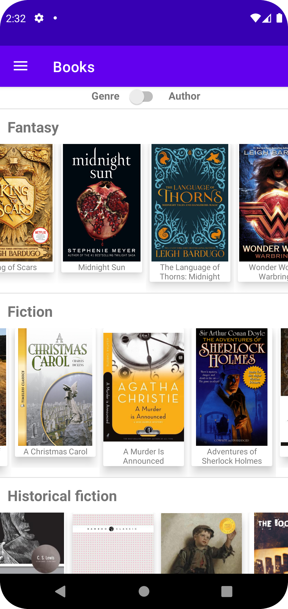
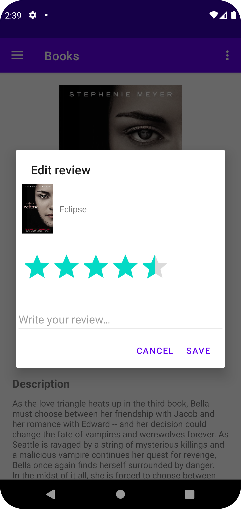
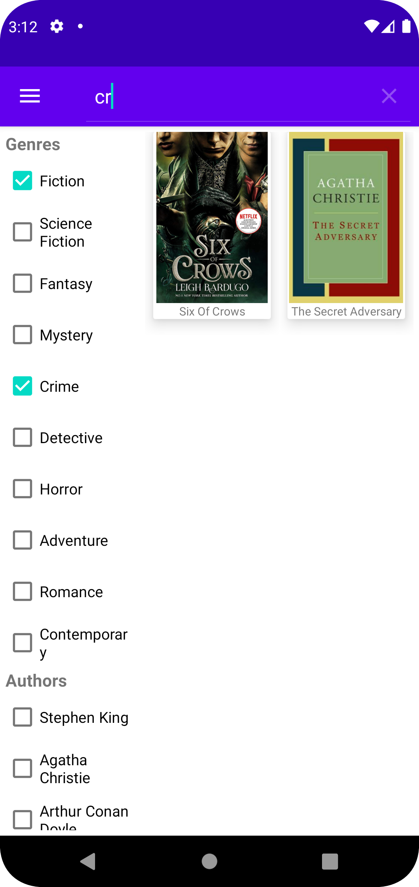

# Books

Welcome to the **Books** repository! This repository contains the code for an Android application written in Java, with a Spring Boot backend. The goal of this application is to provide a platform for book enthusiasts to rate and create custom lists of books they want to read, are currently reading, or have already read.

## Features

- User Registration and Authentication: Users can create an account and log in to the application.
- Book Database: The application utilizes a book database to store information about various books.
- Book Ratings: Users can rate books and provide reviews.
- Book Lists: Users can create and manage custom lists of books based on their preferences.

## Technologies Used

- Android SDK
- Java
- Spring Boot
- PostgreSQL
- Google Storage

## Prerequisites

Before running the **Books** application, make sure you have the following prerequisites:

- Android Studio: Install the latest version of Android Studio, which can be downloaded from the [Android Studio website](https://developer.android.com/studio).
- Java Development Kit (JDK): Make sure you have Java Development Kit (JDK) installed on your system. You can download the JDK from the [Oracle website](https://www.oracle.com/java/technologies/downloads/).
- Maven: Ensure that you have Apache Maven installed. You can download and install Maven from the [Apache Maven website](https://maven.apache.org/download.cgi).
- PostgreSQL: Set up a PostgreSQL database to store the book data. Make sure you have the necessary credentials and connection details for the database.
- Google Cloud Platform (GCP) Account: To use the backend functionalities, you'll need a GCP account to create a project and set up the required services, such as Google Cloud Storage. Refer to the [Google Cloud Platform website](https://cloud.google.com/) for more information on getting started with GCP.
- Google Cloud Storage Bucket: Create a bucket in Google Cloud Storage to store the uploaded files. You will need the name of the bucket to configure the backend application.

Ensure that all the prerequisites are met before proceeding with the installation and usage of the **Books** application.

## Installation

To run the application locally, follow these steps:

1. Clone this repository: `git clone https://github.com/marharita08/Books`.
2. Set up the database:
   - Create database.
   - Use `init.sql` to create necessary tables.
3. Set up the backend:
    - Navigate to the `BooksAPI` directory: `cd Books/BooksAPI`.
    - Install the required dependencies: `./mvnw install`.
    - Upload to the Google Storage bucket default images for author, avatar and book cover.
    - Configure the following properties in the `application.properties` file:

      | Property                                  | Description                                                 |
      |-------------------------------------------|-------------------------------------------------------------|
      | spring.datasource.url                     | The URL of the database.                                    |
      | spring.datasource.username                | The username for the database.                              |
      | spring.datasource.password                | The password for the database.                              |
      | spring.cloud.gcp.project-id               | The ID of your Google Cloud project.                        |
      | spring.cloud.gcp.credentials.location     | The location of the GCP credentials file.                   |
      | gcp.bucket.name                           | The name of the Google Cloud Storage bucket.                |
      | spring.servlet.multipart.max-file-size    | The maximum file size for file uploads.                     |
      | spring.servlet.multipart.max-request-size | The maximum request size for file uploads.                  |
      | books.app.jwtSecret                       | The secret key for JWT token generation and validation.     |
      | books.app.jwtExpirationMs                 | The expiration time (in milliseconds) for JWT tokens.       |
      | default.image.author                      | The name of uploaded default author image.                  |
      | default.image.avatar                      | The name of uploaded default avatar image.                  |
      | default.image.book.cover                  | The name of uploaded default book cover image.              |
      | rapidapi.host                             | Rapidapi host. Uses to fill database with test information. |
      | rapidapi.key                              | Rapidapi key. Uses to fill database with test information.  |

    - Start the backend server: `./mvnw spring-boot:run` or just run `run.cmd` or `run.sh` depending on your OS.
    - To fill database with test information you can open url `backendurl:port/api?author=author` in your browser and specify backend url, port, and author's name. Books written by specified author will be added to database and it's covers will be uploaded to bucket. For example: `localhost:8080/api?author=joanne&rowling`. 

4. Set up the Android application:
    - Open folder Books in Android Studio.
    - If you are going to run the application on physical device - open `src/main/java/com/example/books/utils/URLBuilder.java` and set your backend URL to `API_URL` variable.
    - If your backend uses not default(`8080`) port - open `src/main/java/com/example/books/utils/URLBuilder.java` and change port in `API_URL` variable.
    - Build and run the application on an emulator or physical device.
    

## Usage

Upon launching the application, users can create a new account or log in with their existing credentials. Once logged in, users can access various features of the application, including:

- Browsing the book catalog
- Searching for specific books
- Rating and reviewing books
- Creating and managing custom book lists

Feel free to explore the application and make use of its features to enhance your reading experience!

## Screenshots

  
  
  

